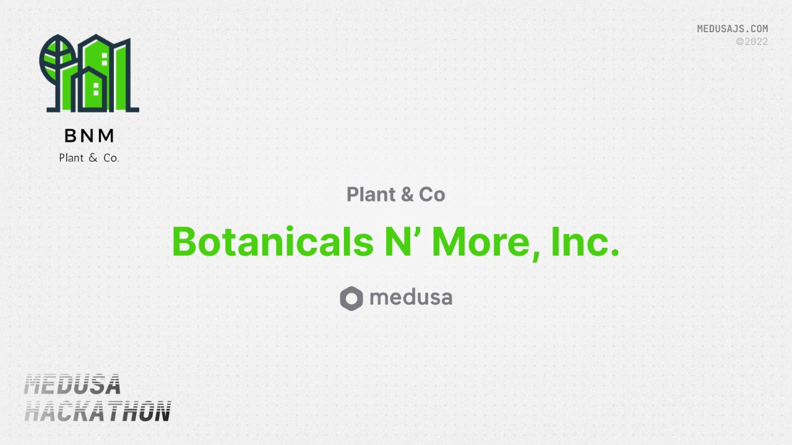

# Interior Plants Store

</img>

## Description

Ordering a pizza is easy but ever heard of ordering a plant to your doorstep? This is where BNM comes in.

An open source demo of ecommerce web storefront for plant lovers built using MedusaJS.It includes products screen, cart, checkout.  This marketplace is easy to maintain and update to the latest Medusa version as it is built entirely with the tools provided by Medusa (no third-party included).

### What is Medusa?

> The Open Source Shopify Alternative
> Medusa is a composable engine that combines an amazing developer experience with endless customizations for merchants to scale.
> Medusa powers ambitious e-com startups to global enterprises with over 10000+ Projects and 2000+ Active Community Members

## Participants

| Name        | Github                                   | Twitter                                      | Discord              |
| ----------- | ---------------------------------------- | -------------------------------------------- | -------------------- |
| Devansh Purwar  | [Github](https://github.com/devansh-purwar/)     | [Twitter](https://twitter.com/purwar_devansh)      | [Discord](https://discordapp.com/users/DEV#8370)       |
| Siddhant Dixit | [Github](https://github.com/siddhantdixit)  | [Twitter](https://twitter.com/iamSidDixit)       | [Discord](https://discordapp.com/users/Siddhant#5865) |
| Prateek Agrawal | [Github](https://github.com/prateekin)  | [Twitter](https://twitter.com/prateekco)       | [Discord](https://discordapp.com/users/abc_123_1#7503) |

## Preview


## Set Up Project

### Prerequisites

Before you start with the tutorial make sure you have

- [Node.js](https://nodejs.org/en/) v16.9.0 or greater installed on your machine

- Medusa CLI (```npm install -g @medusajs/medusa-cli```) .

- Medusa server v14 or greater installed on your machine
- Medusa Admin and Backend up and running

You can install **backend** from here
https://github.com/siddhantdixit/bnm-store

### Install Project

Clone the repo using the following command

```shell
git clone https://github.com/siddhantdixit/bnm-storefront.git
```


Run to view in localhost.

```shell
cd bnm-storefront
npm install && npm run dev
```

Your site is now running at <http://localhost:8000>!

## Resources

- [Medusa’s GitHub repository](https://github.com/medusajs/medusa)
- [Medusa Admin Panel](https://github.com/medusajs/admin)
- [Medusa Documentation](https://docs.medusajs.com/)
